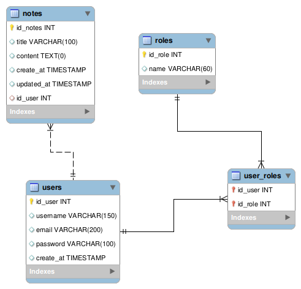

<p align="center">
  
</p>


# 📝 Notepad Star Wars  

A **Star Wars-inspired notepad web application** where users can create, edit, and manage notes with a galactic theme.  
This project includes **user authentication (login/register)**, secure storage of notes, and a themed frontend experience.  

---

## 🚀 Features  
- User **Registration & Login** (JWT Authentication)  
- Create, edit, and delete personal notes  
- Notes stored safely in a **MySQL database**  
- Star Wars-inspired **UI and animations**  
- Responsive design with **HTML5 + CSS3**  
- Interactive frontend powered by **Vanilla JavaScript**  
- Backend API built with **Java + Spring Boot**  

---

## 🛠️ Tech Stack  
### Frontend  
- **HTML5** – semantic structure  
- **CSS3** – custom styles, responsive layout, Star Wars theme  
- **Vanilla JavaScript (ES6)** – DOM manipulation & API integration  

### Backend  
- **Java (17+)** – core language  
- **Spring Boot** – REST API  
- **Spring Security + JWT** – authentication & authorization  
- **Spring Data JPA** – database interactions  

### Database  
- **MySQL** – persistent storage for users & notes  

---

## Project Structure 

#### **notepad-starwars/
│
#### ├── frontend/
- │ ├── index.html # Main notepad page
- │ ├── login.html # Login page
- │ ├── register.html # Registration page
- │ ├── styles.css # Star Wars themed styles
- │ ├── app.js # Notepad logic
- │ ├── login.js # Login API integration
- │ └── register.js # Register API integration

#### ├── backend/
- │ ├── src/main/java/com/starwars/notepad/
- │ │ ├── controller/ # REST controllers
- │ │ ├── model/ # Entities (User, Note)
- │ │ ├── repository/ # JPA repositories
- │ │ ├── security/ # JWT + Security config
- │ │ └── service/ # Business logic
- │ └── src/main/resources/
- │ └── application.properties # DB configs


#### └── README.md**

---

## Database Schema Diagram.

**Made with MySQL Workbench**



---
# Group Work

| Versão | Data       | Alterações                                                                 |
|--------|-----------|---------------------------------------------------------------------------|
| 1.3.0  | 20/08/2025 | ***Sabrina*** created the README file containing the technologies and visual diagram of the project.        |
| 1.2.0  | 15/08/2025 | ***Gabriel*** started the project.  |
| 1.1.0  | 14/08/2025 | Project opening.                                       |

---

# 👨‍💻 Author

### Developed by [Sabrina dos Santos, Gabriel Victor Cardoso, Jéssica Akemy, Hugo Rocha, Maria Núbia, Thomas] ✨
May the Force (and the Code) be with You ⚡

## ⚙️ Installation & Setup  

### 1. Clone the Repository  
```bash
git clone https://github.com/notepad-star-wars/PROJETO_CSM.git
cd your-past-name/PROJETO_CSM